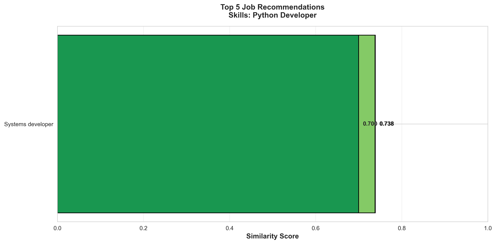
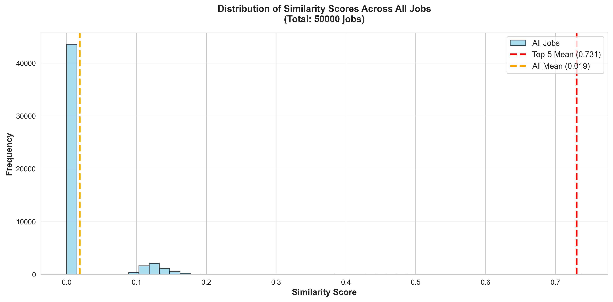
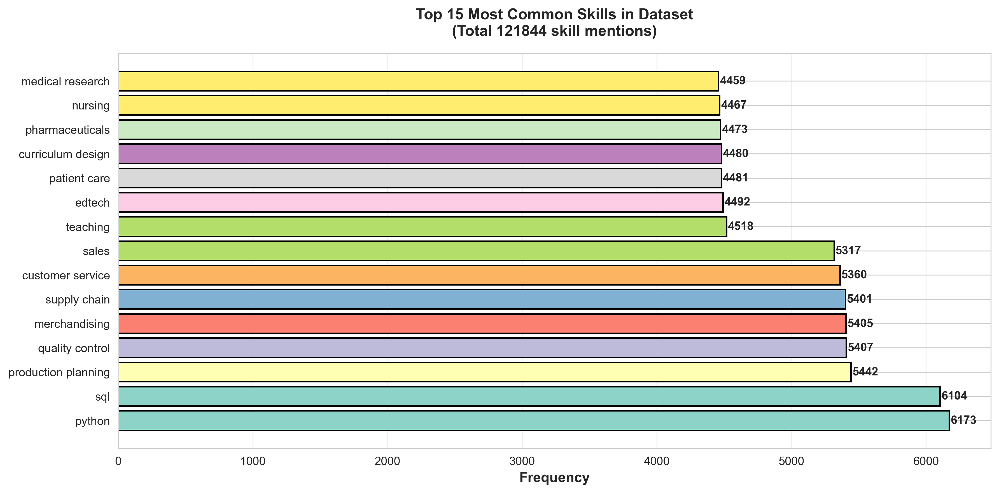

# 📖 User Guide — Job Recommendation System

This document explains how the project works, what each component does, and how to use it step by step.

---

## 📌 What Does This Project Do?

This is a **Machine Learning-based Job Recommendation System** that:

1. Takes your **skills** as input (e.g., "Python, Machine Learning, SQL")
2. Searches through **50,000 real job postings** from Kaggle
3. Finds the **top 5 most relevant jobs** using AI similarity matching
4. Shows you **why** each job matches your skills
5. Generates **professional graphs** and analysis

---

## 🧠 How Does It Work? (Simple Explanation)

### Step 1: Understanding the Data
The system reads a dataset of 50,000 real job postings. Each job has:
- Job Title (e.g., "Data Scientist")
- Company (e.g., "Google")
- Required Skills (e.g., "Python, Machine Learning, SQL")
- Industry (e.g., "Technology")
- Experience Level (e.g., "Mid-Level")

### Step 2: Converting Text to Numbers (TF-IDF)
Computers can't understand text directly, so we convert skills and job descriptions into **numbers** using a technique called **TF-IDF** (Term Frequency–Inverse Document Frequency).

- **TF (Term Frequency):** How often a word appears in a job description
- **IDF (Inverse Document Frequency):** How rare/unique a word is across all jobs
- **Result:** Each job becomes a vector of ~2000 numbers

> **Example:** The word "Python" appears in many jobs (common), while "TensorFlow" appears in fewer (rare). TF-IDF gives higher weight to "TensorFlow" because it's more distinctive.

We also use **bigrams** (pairs of words) so multi-word skills like "Machine Learning" or "Data Analysis" are captured as single features.

### Step 3: Finding Similar Jobs (Cosine Similarity)
When you enter your skills, the system:
1. Converts your skills into the same number format (TF-IDF vector)
2. Compares your vector against all 50,000 job vectors
3. Calculates a **similarity score** (0 to 1) for each job
4. Returns the top 5 with the highest scores

> **Score = 0.85** means 85% similar to your skills

### Step 4: AI Enhancement (Gemma 3 — Optional)
If Docker is running, the system sends the results to **Gemma 3** (Google's AI model) which:
- Explains *why* each job matches your skills in plain English
- Identifies skills you might need to develop
- Provides career direction advice

---

## 🖥️ How to Use the System

### Method 1: Jupyter Notebook (Easiest)

1. Open terminal/command prompt
2. Navigate to the project folder:
   ```bash
   cd AIDS--ML--Project
   ```
3. Start Jupyter:
   ```bash
   jupyter notebook Job_Recommendation_System.ipynb
   ```
4. Click **"Run All"** (or run each cell with Shift+Enter)
5. When prompted, enter your skills:
   ```
   🔍 Your skills: Python, Machine Learning, Data Analysis, SQL
   ```
6. Watch the results appear!

### Method 2: Python Script

```bash
python example_kaggle.py
```
Follow the prompts to enter your skills.

### Method 3: With AI Recommendations (Docker)

```bash
# Start the AI model (first time takes ~5 minutes to download)
docker compose up -d
docker exec ollama-gemma3 ollama pull gemma3

# Then run the notebook or script
jupyter notebook Job_Recommendation_System.ipynb
```

---

## 📊 Understanding the Graphs

### Graph 1: Top 5 Recommendations


- **What:** Horizontal bar chart showing your top 5 job matches
- **X-axis:** Similarity score (0 to 1)
- **Y-axis:** Job titles
- **Color:** Green = better match, Yellow = moderate match
- **Read as:** Longer bar = better match for your skills

### Graph 2: Similarity Score Distribution


- **What:** Histogram of similarity scores across ALL 50,000 jobs
- **Red line:** Average score of your top 5 recommendations
- **Orange line:** Average score across all jobs
- **Read as:** Your top picks should be far to the right (high scores), while most jobs cluster near 0 (low similarity)

### Graph 3: Top Skills in Dataset


- **What:** The 15 most common skills across all jobs in the dataset
- **Read as:** These are the most in-demand skills in the job market (from this dataset)

---

## 🔢 Understanding the Metrics

| Metric | What It Means | Good Value |
|--------|--------------|------------|
| **Similarity Score** | How closely a job matches your skills (0–1) | > 0.5 |
| **Skill Overlap %** | What % of YOUR skills were found in the job listing | > 50% |
| **Top-5 Average** | Average similarity across your 5 recommendations | > 0.6 |
| **Best Match Percentile** | How your best match ranks among all 50K jobs | > 99% |
| **Inference Time** | How fast the system generates recommendations | < 10ms |

### Quality Grades
| Average Score | Grade |
|--------------|-------|
| > 0.6 | ✅ EXCELLENT — Strong skill matches |
| 0.5–0.6 | 🟡 GOOD — Relevant recommendations |
| 0.4–0.5 | 🟠 FAIR — Some relevant jobs found |
| < 0.4 | 🔴 POOR — Limited matches (try different skills) |

---

## 🧩 Understanding the Code Modules

### `ml_module/kaggle_adapter.py` — Data Adapter
**Purpose:** Loads the Kaggle CSV file and standardizes column names.

**What it does:**
- Reads `data/job_recommendation_dataset.csv`
- Maps columns: `Job Title` → `job_title`, `Required Skills` → `required_skills`
- Handles missing values
- Creates a text corpus for TF-IDF

### `ml_module/job_recommendation_kaggle.py` — ML Engine
**Purpose:** The core recommendation system.

**What it does:**
- `preprocess_text()` — Cleans text (lowercase, remove special chars)
- `vectorize_data()` — Creates TF-IDF vectors with bigram support
- `recommend_jobs()` — Finds top-K similar jobs using cosine similarity
- `save_model()` / `load_model()` — Saves trained model to disk

### `ml_module/evaluation_kaggle.py` — Evaluation
**Purpose:** Measures how good the recommendations are.

**Metrics:**
- **Precision@K** — What fraction of top-K results are relevant?
- **Recall@K** — What fraction of all relevant jobs appear in top-K?
- **MRR@K** — How high does the first relevant job appear?

### `ml_module/visualization_kaggle.py` — Graphs
**Purpose:** Generates publication-quality charts.

### `ml_module/gemma_recommender.py` — AI Enhancement
**Purpose:** Connects to Gemma 3 for AI-powered explanations.

**How it works:**
1. Ollama runs Gemma 3 model inside a Docker container
2. Python sends recommendations to Gemma 3 via REST API (port 11434)
3. Gemma 3 returns natural language explanations
4. If Docker isn't running, the system works normally without AI

---

## 🔬 ML Concepts Used

### Supervised Learning
- **What:** Learning from labeled examples (input → known output)
- **In this project:** Job category classification — training a classifier to predict what industry a job belongs to based on its skills
- **Algorithms:** Logistic Regression, Random Forest

### Unsupervised Learning
- **What:** Finding patterns without labels
- **In this project:** Clustering jobs into groups based on skill similarity
- **Algorithms:** K-Means clustering

### TF-IDF (Term Frequency–Inverse Document Frequency)
- **What:** A way to measure how important a word is to a document
- **Formula:** `TF-IDF = TF(word) × log(total_docs / docs_containing_word)`
- **In this project:** Converts job descriptions into numerical vectors

### Cosine Similarity
- **What:** Measures the angle between two vectors (0 = orthogonal, 1 = identical)
- **Formula:** `cos(θ) = (A · B) / (||A|| × ||B||)`
- **In this project:** Compares user skill vector to all job vectors

### K-Means Clustering
- **What:** Groups similar items into K clusters
- **In this project:** Groups similar jobs together
- **Elbow Method:** Used to find optimal number of clusters

### PCA (Principal Component Analysis)
- **What:** Reduces high-dimensional data to 2D/3D for visualization
- **In this project:** Projects 2000-dim TF-IDF vectors to 2D scatter plots

### t-SNE (t-distributed Stochastic Neighbor Embedding)
- **What:** Non-linear dimensionality reduction for visualization
- **In this project:** Better cluster separation than PCA

---

## ❓ FAQ

**Q: Do I need Docker to run the project?**
A: No! Docker is only needed for the Gemma 3 AI enhancement. The core TF-IDF recommendation system works without it.

**Q: How long does it take to run?**
A: Without AI: ~5 seconds total. With Gemma 3 AI: ~1–2 minutes (depends on hardware).

**Q: Can I use my own dataset?**
A: Yes! Place your CSV in the `data/` folder with columns: `Job Title`, `Required Skills`, `Company`, `Location`, `Industry`, `Experience Level`.

**Q: What if my skills show low scores?**
A: Try using common skill terms. The system matches based on exact words, so "JS" won't match "JavaScript" — use the full term.

**Q: How do I add more skills to search?**
A: Just type them comma-separated: `Python, Django, REST API, PostgreSQL, Docker, AWS`

**Q: Can I change the number of recommendations?**
A: Yes! In the code, change `top_k=5` to any number (e.g., `top_k=10`).

---

## 📞 Support

If you encounter issues:
1. Make sure you're in the project root directory
2. Run `pip install -r requirements.txt`
3. Check that `data/job_recommendation_dataset.csv` exists
4. For Docker issues, ensure Docker Desktop is running

---

**Project:** AIDS ML Project — Artificial Intelligence & Data Science  
**Version:** 3.0.0  
**Last Updated:** April 13, 2026
